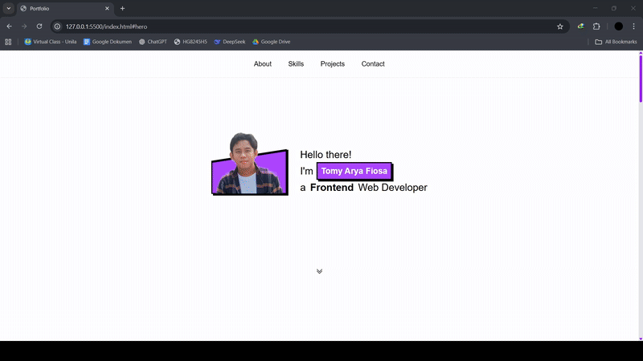

# Tugas Akhir 2: Website Portfolio dengan Git Workflow

Ini adalah proyek website portfolio pribadi yang dibuat sebagai bagian dari **Tugas Akhir 2**. Fokus utama dari tugas ini adalah untuk mengimplementasikan alur kerja (workflow) Git yang lengkap, mulai dari inisialisasi repositori, melakukan commit secara bertahap untuk setiap bagian website, hingga mengelola branch untuk pengembangan fitur baru (styling).

Proyek ini mendemonstrasikan pemahaman dasar HTML/CSS sekaligus praktik manajemen kode sumber yang baik menggunakan Git.


## 🚀 Teknologi yang Digunakan

* **HTML5**
* **CSS3**
* **Git**
* **GitHub**

## 🖥️ Instalasi dan Penggunaan

**Untuk menjalankan secara lokal:**

1.  **Clone repositori** ini ke komputer Anda:
    ```bash
    git clone https://github.com/Tomiyaf/tugas-akhir-pw-2.git
    ```

2.  **Buka direktori** proyek yang baru saja di-clone:
    ```bash
    cd [NAMA_REPOSITORI_ANDA]
    ```

3.  **Buka file `index.html`** langsung di browser pilihan Anda (Google Chrome, Firefox, dll.) untuk melihat hasilnya.

## Git Workflow (Alur Kerja Pengembangan)

Proyek ini dikembangkan menggunakan alur kerja Git yang sistematis untuk mencatat setiap perubahan:

1.  **Inisialisasi Proyek**:
    * Membuat repositori baru di GitHub.
    * Inisialisasi Git pada folder proyek lokal (`git init`).
    * Menghubungkan repositori lokal dengan repositori remote di GitHub (`git remote add origin ...`).

2.  **Commit Awal (Kerangka)**:
    * Melakukan commit pertama untuk kerangka dasar `index.html`, yang terdiri dari bagian `navbar` dan `footer`.

3.  **Commit Bertahap (per Section)**:
    * Setiap bagian utama website dibuat dan di-commit secara terpisah untuk pelacakan yang jelas.
    * Commit Hero Section
    * Commit About Section
    * Commit Skills Section
    * Commit Projects Section
    * Commit Contact Section

4.  **Pengembangan Fitur (Branching)**:
    * Membuat branch baru bernama `styling` untuk mengerjakan perubahan CSS tanpa mengganggu branch `main` (`git branch styling`).
    * Pindah ke branch baru (`git checkout styling`).
    * Melakukan commit untuk semua perubahan styling dan perbaikan CSS pada branch ini.

5.  **Penggabungan (Merge)**:
    * Setelah styling selesai dan diuji di branch `styling`, kembali ke branch `main` (`git checkout main`).
    * Menggabungkan (merge) semua perubahan dari `styling` ke `main` (`styling`) sehingga `main` memiliki kode fungsional dan styling terbaru.


## Demo Proyek




6.  **Push ke GitHub**:
    * Mendorong (push) versi final dari branch `main` ke repositori remote di GitHub (`git push origin main`).
